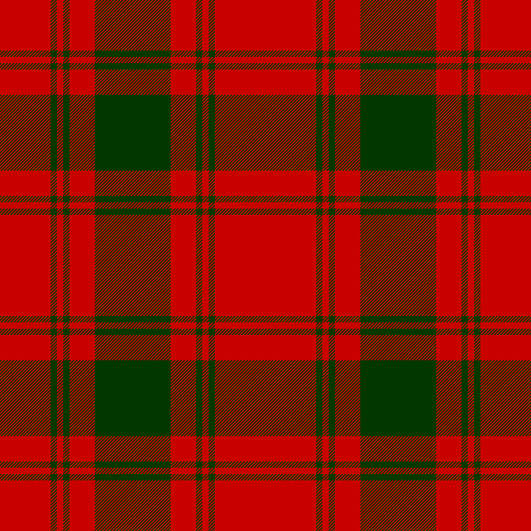

# Clan MacQuarie Tartan Generator

<iframe src="./main.html" height="500px" scrolling="no"
  style="overflow: hidden;"></iframe>

  

You can include this MicroSim in your course by pasting the following HTML directly into your web page.

```html
<iframe src="https://dmccreary.github.io/signal-processing/sims/SIM_NAME/main.html" height="480px" scrolling="no"
  style="overflow: hidden;"></iframe>
```

[Run the MicroSim](./main.html){ .md-button .md-button--primary }

[Edit the MicroSim]()

## MicroSim Description

We would like to draw clan maps and fill in their tartan colors in the background.  Can we use JavaScript to generate each pattern?

1. In this demo, we use a set of color bands to draw a tartan.
2. We see that the same band pattern is used both vertically and horizontally
3. We first draw a vertical band pattern, but then we need to use a color blend algorithm for the horizontal layer
4. We try various blend options to simulate the weave pattern
5. We show that using the MULTIPLY blend with the opacity gets close, but not good enough